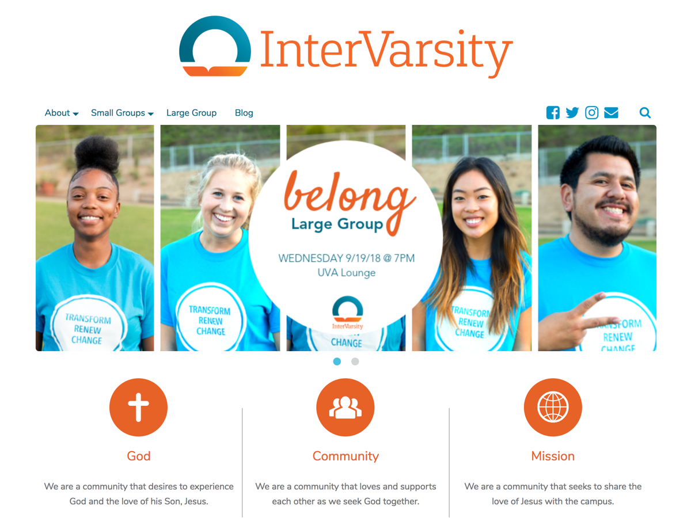

# InterVarsity WordPress Theme

*Copyright 2015-2025 Caleb Evans*  
*Released under the GNU General Public License v3.0*

The InterVarsity Theme is a WordPress theme intended for [InterVarsity Christian
Fellowship/USA](https://intervarsity.org/) chapters with a WordPress site. I
originally created the theme for the [InterVarsity North County chapter
website](https://ivnorthcounty.org/), but I have since decided to open-source
the theme for the benefit of all InterVarsity chapters. Please note that this is
an unofficial theme which is not affiliated with InterVarsity.

This theme integrates perfectly with the [InterVarsity
Plugin](https://github.com/caleb531/intervarsity-plugin), which I also created
for the InterVarsity North County website. The plugin allows you to create and
manage small groups, and this theme includes templates for displaying them. This
theme also integrates with several other features of the plugin, including page
sliders and a Facebook Like Button.

[Download InterVarsity Theme (ZIP)](https://github.com/caleb531/intervarsity-theme/releases/download/v5.0.0/intervarsity-theme-5.0.0.zip)  
[Download InterVarsity Plugin (ZIP)](https://github.com/caleb531/intervarsity-plugin/releases/download/v4.0.0/intervarsity-plugin-4.0.0.zip)

## Requirements

1. Your site must be running WordPress 4.5 or newer.

2. You must install and activate the aforementioned [InterVarsity
Plugin](https://github.com/caleb531/intervarsity-plugin) (v3.0.0 or newer), as
well as the one plugin it requires, [Awesome
CPT](https://github.com/caleb531/awesome-cpt).

## Features

### Design

The theme sports a clean, responsive design which focuses on content and user
experience. While the theme design shines brightest on desktops and laptops, all
features and behaviors of the theme are accessible on mobile devices without
compromising any aspect of the site experience.

### Small group templates

The theme provides several templates for displaying small groups:

- You can view any individual small group at `yourchapter.com/small-group/my-group/`.
- You can view all small groups for a particular campus at `yourchapter.com/small-groups/campus/my-campus/`.
- You can view all small groups for a particular category at `yourchapter.com/small-groups/category/my-category/`.
- You can view all small groups irrespective of campus or category at `yourchapter.com/small-groups/archive/`.

#### Small group filters

Every page that lists small groups includes dropdown menus which allow you to
filter those respective small groups by campus, category, and day of the week.

### Related small groups

Every individual small group page not only lists details for that particular
group, but also the names and times of other small groups which the theme has
deemed to be similar. Clicking the name of any of these related small groups
will take you to the full page for that small group.

### Small group search

The InterVarsity Theme allows you to search for small groups using the search
icon which sits on the right side of the site header. The search function is
designed to match (in any order) whole words contained in any of the following
small group fields:

- Name
- Time
- Location
- Leaders
- Campus
- Category

#### Example queries

- `csusm athletes`
- `monday palomar`
- `brian's group`
- `womens group commuter`

### Social header

The theme displays social icons which link to your chapter's profile pages on
Facebook, Twitter, and Instagram. You can also enable a icon which links to the
chapter's email address (clicking it will launch the visitor's email app). These
icons sit in the site header, and can be selectively enabled (they are disabled
by default).

### Cyclone Slider 2 integration

The InterVarsity Plugin that integrates with this theme allows you to assign an
existing [Cyclone Slider 2](https://wordpress.org/plugins/cyclone-slider-2/)
slider to any page you've created. Needless to say, this theme will display the
slider for any page that has one assigned to it.

Currently, this theme only supports the *Default* and *Standard* templates for
sliders, so be sure to use either of those!

### Front page content boxes

You can also enable up to three content boxes which can be used to describe the
vision for your chapter and direct visitors to other pages on your site.

### WP Maintenance Mode integration

The InterVarsity Theme also integrates with the [WP Maintenance
Mode](https://wordpress.org/plugins/wp-maintenance-mode/) plugin by applying the
chosen fonts and colors to the active maintenance page.

### Everything else

There are many more features and options available in the InterVarsity Theme,
including options for the site footer, small group settings, and a slew of
customizable messages. All of these options are available in the WordPress
Customizer.

## Credits

I originally created the InterVarsity Theme as a child theme of [Engrave
Lite](https://wordpress.org/themes/engrave-lite/), and while I have since
rewritten substantial portions of my theme to make it more distinct and fully
independent, remnants of Engrave's design and markup are still present.

The InterVarsity logo apart of this theme (used as the default header image) is
a registered trademark of InterVarsity Christian Fellowship/USA.
